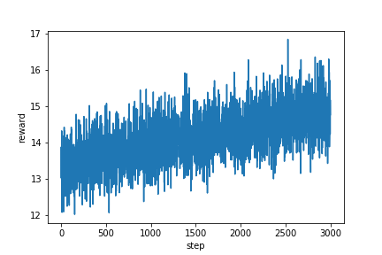

# PENS - ACL2021
## {PENS}: A Dataset and Generic Framework for Personalized News Headline Generation
This is a Pytorch implementation of [PENS](https://www.microsoft.com/en-us/research/uploads/prod/2021/06/ACL2021_PENS_Camera_Ready_1862_Paper.pdf). 

## I. Guidance

### 0. Enviroment
- Install pytorch version >= '1.4.0'
- Install the pensmodule package under ''PENS-Personalized-News-Headline-Generation'' using code ``` pip install -e . ```

### 1. Data Prepare
- Download the PENS dataset [here](https://msnews.github.io/pens.html) and put the dataset under data/.
- (optional) Download glove.840B.300d.txt under data/ if you choose to use pretrained glove word embeddings.

### 2. Running Code
- ```cd pensmodule ```
- Follow the order: Preprocess --> UserEncoder --> Generator and run the pipeline**.ipynb notebook to preprocess, train the user encoder and the train generator, individually.


More infor please refer to the homepage of the [introduction of PENS dataset](https://msnews.github.io/pens.html).

## II. Training Tips

Here we take NRMS as user encoder, the followings are some experiment detailes that are not illustrated in the paper.

### 0. TIPS
- In this paper, we used mento carlo search for RL training, which is very slow in training and sometimes hard to converge. Thus we provide ac training in this provided code.
- If you pretrain the generator for a couple of epoches, you should set a very small learning rate during RL training.
- <span style="color:lightblue">Large improvements can be made compared with the baselines that we provided, the importance always lies in the design of reward functions.</span>. 


### 1. Training Reward


### 2. Test performance on different training epoches


### 3. Cases
| epoch | generated headline | 
| :-----| ----: |
| Case 1 |  | 
| 1000 | top stockton news arrests 2 impaired drivers | 
| 5000 | top stockton news arrests 2 impaired drivers who had unrestrained children in their cars | 
| Case 2 |  | 
| 1000 | trump says tens of thousands of people couldn t get in 2020 rally | 
| 5000 | trump says tens of thousands of people outside his 2020 campaign rally at orlando | 

**Noted:**
- With the training process goes, the generated sentences are more fluent and contains more rich information.
- <span style="color:lightblue"> *Rouge scores is not the best evaluation scores, but a compromising choice. Of course the best evaluation is to check out the real clicks of users to see if they are more interested. Thus sometimes a more fluent and human-like generated sentence gets lower rouge scores.*</span>. 


